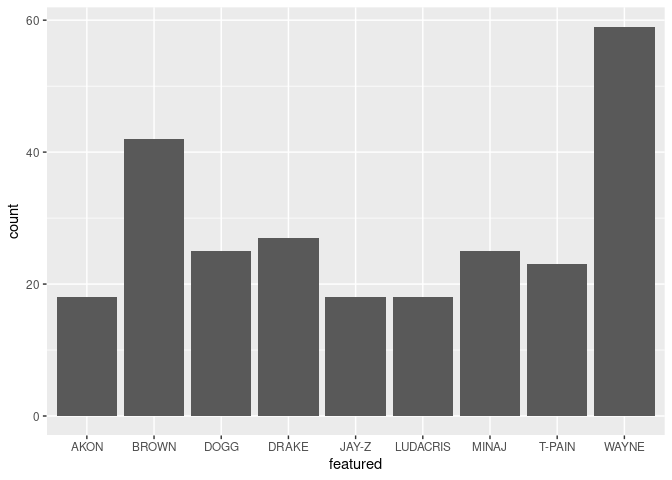

Activity 8
================
Nathan Vandermeer

## Data and packages

Load the entirety of the `{tidyverse}`. `{forcats}` and `{stringr}` are
loaded as part of this. If you wish to work with dates during this
activity, you will need to also load `{lubridate}`. Be sure to avoid
printing out any unnecessary information and give the code chunk a
meaningful name.

``` r
library(tidyverse)
library(lubridate)
```

Cheatsheets that you might want to add to your collection:

-   [`{stringr}`](https://stringr.tidyverse.org/)
-   [`{forcats}`](https://forcats.tidyverse.org/)
-   [`{lubridate}`](https://lubridate.tidyverse.org/)

Using `here::here`, upload the `billboard_songs.txt` file that is saved
in your `data` folder. Notice that this file is a tab-delimited file
that is stored as a `.txt` file. Therefore, you will need to use either
`read_delim` with a `delim = ...` argument or (better) `read_tsv` .
Assign the file to a meaningful object name, be sure to avoid printing
any unnecessary information, and give the code chunk a meaningful name.

``` r
songs <- read_tsv(here::here("data","billboard_songs.txt"))
```

    ## 
    ## ── Column specification ────────────────────────────────────────────────────────
    ## cols(
    ##   title = col_character(),
    ##   artist = col_character(),
    ##   `overall peak` = col_double(),
    ##   `weeks on chart` = col_double(),
    ##   `chart date` = col_double()
    ## )

``` r
songs
```

    ## # A tibble: 34,605 x 5
    ##    title           artist           `overall peak` `weeks on chart` `chart date`
    ##    <chr>           <chr>                     <dbl>            <dbl>        <dbl>
    ##  1 Uptown Funk!    MARK RONSON fea…              1               15     20150307
    ##  2 Thinking Out L… ED SHEERAN                    2               20     20150307
    ##  3 Love Me Like Y… ELLIE GOULDING                3                7     20150307
    ##  4 Sugar           MAROON 5                      4                6     20150307
    ##  5 Take Me To Chu… HOZIER                        2               28     20150307
    ##  6 FourFiveSeconds RIHANNA & KANYE…              4                5     20150307
    ##  7 Blank Space     TAYLOR SWIFT                  1               17     20150307
    ##  8 Style           TAYLOR SWIFT                  8                9     20150307
    ##  9 Earned It (Fif… THE WEEKND                    9                9     20150307
    ## 10 Lips Are Movin' MEGHAN TRAINOR                4               18     20150307
    ## # … with 34,595 more rows

These data include information on song popularity. In the US, the
Billboard Hot 100 is a list that comes out every week, showing the 100
most played songs that week. More information about the creation of this
dataset, as well as some analyses by the author, can be found here:
<https://mikekling.com/analyzing-the-billboard-hot-100/>. The dataset
you are provided is a limited version of the full data, containing:

-   `title`
-   `artist`
-   `overall peak`: The highest rank the song ever reached (1 is the
    best)
-   `weeks on chart`: The number of weeks the song was on the chart
-   `chart date`: The latest date the song appeared on the Billboard Hot
    100

This is a long dataset (34,605 observations)! You might like to create a
small dataset with only, say, 200 of the rows to try all your code out
on the smaller dataset first, and then only run the analysis of the full
data after you have experienced everything. One way to do this is to use
a function like `slice_sample(n = ...)` from `{dplyr}`.

    # Randomly sample 200 rows
    songs %>% 
      slice_sample(n = 200)

If you wish to work with `{stringr}`, I find it useful to work on
vectors first. A way to do this is with `pull` from `{dplyr}`.

    # Turn variable from dataset into a vector
    dataset %>% 
      pull(variable)

## Analysis

You are encouraged to explore these data as you wish using functions
from the packages for the three special variable types. Some ideas that
you might be interested in:

-   What 10 songs (display title, artist, and week) were on the charts
    for the longest?

``` r
songs %>% 
  arrange(desc(`weeks on chart`))
```

    ## # A tibble: 34,605 x 5
    ##    title           artist           `overall peak` `weeks on chart` `chart date`
    ##    <chr>           <chr>                     <dbl>            <dbl>        <dbl>
    ##  1 Radioactive     IMAGINE DRAGONS               3               85     20140510
    ##  2 I'm Yours       JASON MRAZ                    6               76     20091010
    ##  3 How Do I Live   LeANN RIMES                   2               69     19981010
    ##  4 Counting Stars  ONEREPUBLIC                   2               68     20141018
    ##  5 Party Rock Ant… LMFAO featuring…              1               67     20120721
    ##  6 Foolish Games … JEWEL                         2               65     19980221
    ##  7 Rolling In The… ADELE                         1               64     20120414
    ##  8 Before He Chea… CARRIE UNDERWOOD              8               64     20071201
    ##  9 Ho Hey          THE LUMINEERS                 3               62     20130824
    ## 10 Need You Now    LADY ANTEBELLUM               2               60     20101016
    ## # … with 34,595 more rows

-   What distinct date did the oldest song(s) leave the charts?

``` r
songs %>% 
  arrange(`chart date`) %>% 
  mutate(leaving_date=ymd(`chart date`)+weeks(`weeks on chart`))
```

    ## # A tibble: 34,605 x 6
    ##    title     artist    `overall peak` `weeks on chart` `chart date` leaving_date
    ##    <chr>     <chr>              <dbl>            <dbl>        <dbl> <date>      
    ##  1 Playmates KAY KYSE…              4                1     19400720 1940-07-27  
    ##  2 Where Wa… CHARLIE …              6                1     19400720 1940-07-27  
    ##  3 Imaginat… TOMMY DO…              8                1     19400720 1940-07-27  
    ##  4 Make-Bel… MITCHELL…             10                1     19400720 1940-07-27  
    ##  5 Make-Bel… JAN SAVI…              8                1     19400727 1940-08-03  
    ##  6 Imaginat… GLENN MI…              3                3     19400803 1940-08-24  
    ##  7 Pennsylv… GLENN MI…              5                6     19400824 1940-10-05  
    ##  8 When The… GLENN MI…             10                1     19400824 1940-08-31  
    ##  9 6 Lesson… JIMMY DO…              7                2     19400831 1940-09-14  
    ## 10 Fools Ru… GLENN MI…              8                2     19400907 1940-09-21  
    ## # … with 34,595 more rows

-   What songs could have been played at your 16th birthday party? That
    is, which songs that eventually peaked at \#1 **entered** the charts
    within a couple months (before or after) your 16th birthday?

``` r
bday16=ymd(20170410)
songs %>% 
  mutate(date_diff=abs(ymd(`chart date`) - bday16)) %>% 
  filter(`overall peak` == 1, (date_diff) < 800) %>% 
  arrange(date_diff)
```

    ## # A tibble: 5 x 6
    ##   title     artist        `overall peak` `weeks on chart` `chart date` date_diff
    ##   <chr>     <chr>                  <dbl>            <dbl>        <dbl> <drtn>   
    ## 1 Uptown F… MARK RONSON …              1               15     20150307 765 days 
    ## 2 Blank Sp… TAYLOR SWIFT               1               17     20150307 765 days 
    ## 3 Shake It… TAYLOR SWIFT               1               27     20150307 765 days 
    ## 4 All Abou… MEGHAN TRAIN…              1               33     20150307 765 days 
    ## 5 Rude      MAGIC!                     1               41     20150214 786 days

Assuming you were 16 years old by 2015. - Which artist has been
**featured** on the most Billboard charting songs?

``` r
x <- songs$artist %>% 
  factor()

data.frame(artist=x) %>% 
  group_by(artist) %>% 
  mutate(total=n()) %>% 
  arrange(desc(total)) %>% 
  distinct(artist,total)
```

    ## # A tibble: 11,115 x 2
    ## # Groups:   artist [11,115]
    ##    artist          total
    ##    <fct>           <int>
    ##  1 GLEE CAST         167
    ##  2 ELVIS PRESLEY     150
    ##  3 FRANK SINATRA      85
    ##  4 RAY CHARLES        84
    ##  5 PERRY COMO         81
    ##  6 FATS DOMINO        81
    ##  7 NAT KING COLE      78
    ##  8 ARETHA FRANKLIN    77
    ##  9 JAMES BROWN        76
    ## 10 PATTI PAGE         72
    ## # … with 11,105 more rows

-   Which artist has **collaborated** on the most Billboard charting
    songs?

``` r
y <- songs %>% 
  filter(str_detect(artist,'feat')) %>% 
  mutate(featured=word(artist,-1))
y2 <- y$featured %>% 
  factor()
y <- data.frame(featured=y2) %>% 
  group_by(featured) %>% 
  mutate(total=n()) %>% 
  arrange(desc(total)) %>% 
  distinct(featured,total)
y
```

    ## # A tibble: 743 x 2
    ## # Groups:   featured [743]
    ##    featured total
    ##    <fct>    <int>
    ##  1 WAYNE       59
    ##  2 BROWN       42
    ##  3 DRAKE       27
    ##  4 DOGG        25
    ##  5 MINAJ       25
    ##  6 T-PAIN      23
    ##  7 JAY-Z       18
    ##  8 AKON        18
    ##  9 LUDACRIS    18
    ## 10 ROSS        15
    ## # … with 733 more rows

``` r
y <- data.frame(featured=y2) %>% 
  group_by(featured) %>% 
  mutate(total=n()) %>% 
  filter(total>15)
y
```

    ## # A tibble: 255 x 2
    ## # Groups:   featured [9]
    ##    featured total
    ##    <fct>    <int>
    ##  1 BROWN       42
    ##  2 WAYNE       59
    ##  3 DRAKE       27
    ##  4 DRAKE       27
    ##  5 DOGG        25
    ##  6 WAYNE       59
    ##  7 BROWN       42
    ##  8 MINAJ       25
    ##  9 DRAKE       27
    ## 10 BROWN       42
    ## # … with 245 more rows

-   Create some data visualization controlling the order of the
    character/string variables.

``` r
ggplot(data=y) + 
  geom_bar(mapping=aes(x=featured))
```

<!-- -->

## Attribution

Parts of this Activity are based on a lab from [Dr. Kelly
Bodwin’s](https://www.kelly-bodwin.com/) STAT 331 course.
